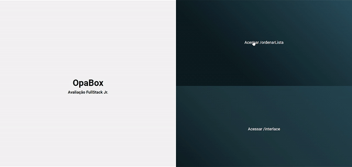
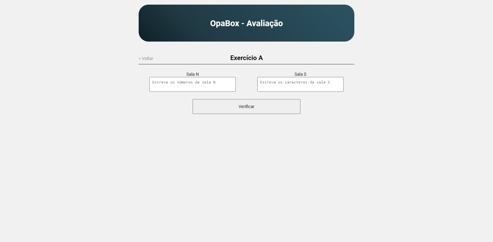
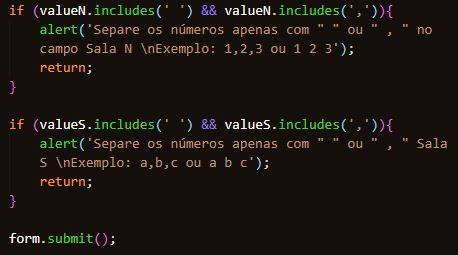
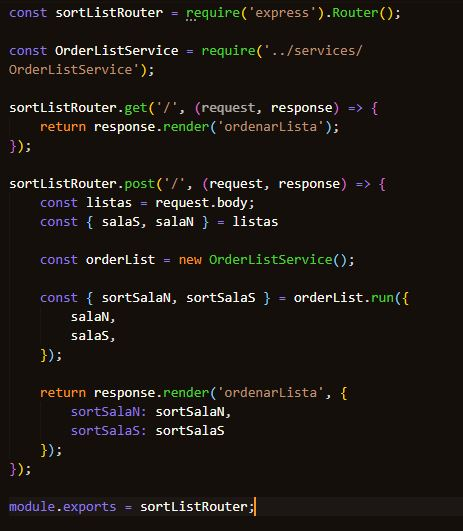
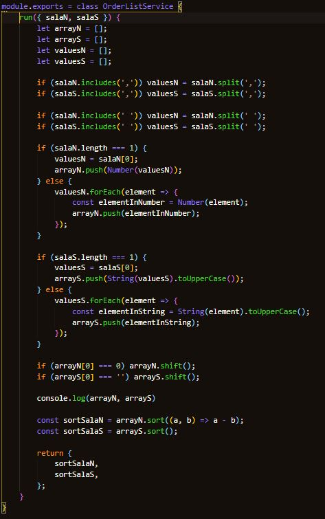

# 🚀 OpaBox - Avaliação FullStack Júnior / JS

## 📖 Sobre

A proposta da avaliação é desenvolver uma API com os métodos GET e POST utilizando requisições do tipo *query* e *body*.

<br>

---

<br>

## 💾 Tecnologias e recursos utilizados

- HTML, CSS, JavaScript
- NodeJS
    - [Express](https://expressjs.com/pt-br/api.html)
    - [HBS](https://handlebarsjs.com/)
    - [bodyParser](https://www.npmjs.com/package/body-parser)

<br>

---

<br>

## 📁 Clonando repositório

```bash
$ git clone https://github.com/LanPRD/avaliacao-opabox

$ cd avaliacaoOpaBox

$ npm install

$ npm start
```

<br>

---

<br>

## 🚧 Projeto
## Tela inicial

<h6 align="center">
    
</h6>

<br>

A página inicial é constituída apenas de HTML e CSS.<br>
Foi utilizado apenas flexbox em seu desenvolvimento.

<br>

## Página ordenarLista



A rota **/ordenarLista** (rota solicitada na documentação enviada por e-mail) apresenta um formulário simples com dois campos (*textarea*).<br><br>

Esta página possui o método GET para a renderização da mesma e o método POST que é requisitado assim que o usuário clicar no botão *Verificar*.

O botão *Verificar* ainda possui uma função que é chamada ao clicar. Esta função é responsável por fazer uma breve verificação do que foi digitado.

<br>

<h6 align="center">
    
</h6>

<br>

### Backend

Todo o backend foi construido utilizando o conceito SOLID.<br>
A rota **/ordenarLista**, no backend, possui a seguinte estrutura:

<h6 align="center">
    
</h6>

<br>

A **regra de negócio** é constituida pelo tratamento dos dados recebidos e retornada ao front-end para o usuário.
<br>

<h6 align="center">
    
</h6>

<br>
<br>

## Página interlace


A rota **/interlace** (rota solicitada na documentação enviada por e-mail) apresenta um formulário simples com dois campos (*textarea*), assim como na rota anterior.<br><br>

### Backend

O backend desta rota possui a mesma estruturação da rota anterior, mudando apenas a questão da requisição (*query*) e as **regras de negócio**.

<br>
<br>

<h6 align="center" font-size="11">Developed by <strong>Allan Prado</strong></h6>